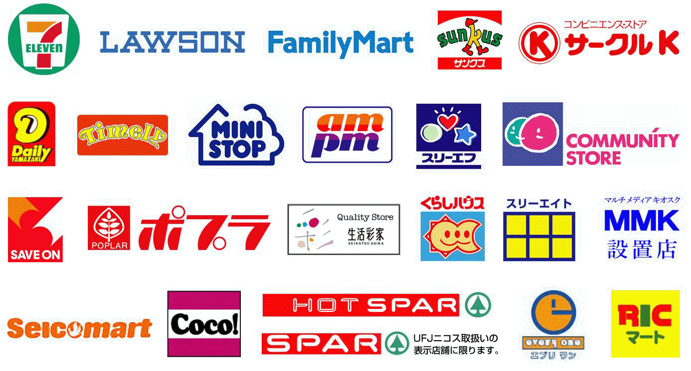

<h1 align="center" >Need to go Now</h1>

    <h1 align="center">
    
    </h1>

# Table of Contents

1.[Introduction](#introduction)

2.[Set Up](#set-up)

3.[Objectives and Instruction](#objectives-and-instructions)

3.[Features](#Features)

# Introduction

This database API was created during my time as student at Code Chrysalis. Convenience stores in Japan are more than simple solution to you utility and amenity needs. Service provided by a convenience store can stretch from fax, copy, banking to high quality cafe and limited time events. However, each convenience store is varied in the services it provides, hence, requiring additional information if customer was looking for specific service. This API is built starting on most essential feature that a convenience store should have: toilet.

# Set-up

Postgres

You will need postgres installed. If you haven't installed it already, download and install the PostgresApp and verify its working by running the command psql in your terminal.

Create a database for this project by running:

    echo "CREATE DATABASE convini;" | psql

Installing Dependencies and Startup
Example:

To install dependencies:

    yarn
To run migrations and set up the database:

    yarn migrate:latest
To roll back migrations

    yarn rollback

To seed initial data:

    yarn seed:run

To run the app:

    yarn start

# Objectives and Instructions

The initial objective from here is to collect as much convenience store location as possible. With limiting the current parameter of convenience location to 23 ward of Tokyo (list of 23 wards : https://en.wikipedia.org/wiki/Special_wards_of_Tokyo), we are looking to gather location information of convenience stores of diverse brands. With the project being in very early stage, we would like to start with collecting data of 3 major convenience store brands: Seven Eleven, Family Mart and Lawson. Being a straight forward REST API application, we are focused in gathering data and any suggestion on either data collecting methods or future direction of the project is welcome.

# Features

In current stage of development, this application has a Working API endpoints for querying Bunkyo, Chuo, Koto, Nakano, Shinjuku, Shibuya, Sumida, Taito wards about convenience stores of brands Seven Eleven, Family Mart and Lawson.
<pre>

</pre>
---

Code Chrysalis API Solo Project

 

<b>Linkedin</b>:  

[Brian Lee](https://www.linkedin.com/in/briansunghaklee/)

